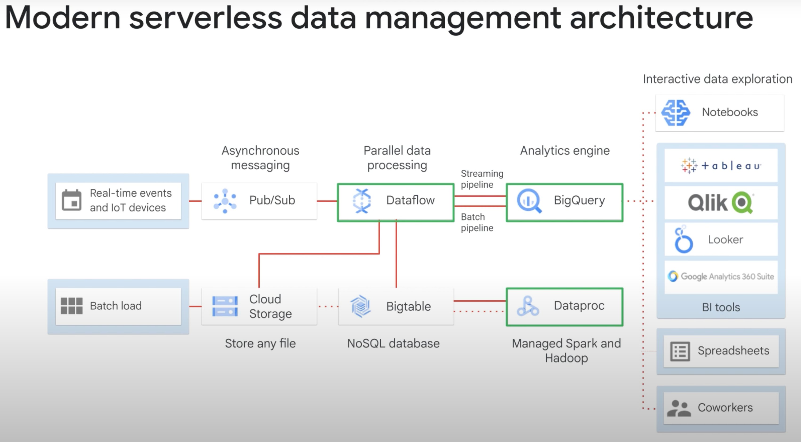

# Cloud SQL

- easy-to-use service that delivers fully managed relational databases.
- hand off to Google the mundane, but necessary and often time-consuming tasks like applying patches and updates, managing backups, and configuring replications so we can put your focus on building great applications
- managed service for third party RDBMSs
- supports MySQL, PostgreSQL and Microsoft SQL Server
- Google Cloud manages the MySQL database to the point where we can treat it as a service
- Cloud SQL with App Engine using standard drivers like Connector J for Java or MySQL DB for Python.
- Cloud SQL customer data is encrypted when on Google's internal networks, and when stored in database tables, temporary files and backups
- Cloud SQL takes care of securely storing our backed up data and makes it easy for us to restore from a backup and perform a point in time recovery to a specific state of an instance.
- Cloud SQL retains up to seven backups for each instance, which is included in the cost of our instance.
- We can vertically scale Cloud SQL, just increase our machine size. Scale up to 64 processor cores and more than 100 gigabytes of RAM.
- Horizontally, we can quickly scale out with read replicas. Google Cloud SQL supports three read replica scenarios Cloud SQL instances replicating from a Cloud SQL primary instance.
- If we need horizontal read-write scaling, consider Cloud Spanner.

## Failovers

- For the special case of failover, Cloud SQL supports this. Cloud SQL instances can be configured with a failover replica in a different zone in the same region. Then, Cloud SQL data is replicated across zones within a region for durability.
- In the unlikely event of a datacentre outage, a Cloud SQL instance will automatically become available in another zone. All changes made to data on the primary are replicated to failover.
- If the primary instances zone has an outage, Cloud SQL automatically failsover to the replica. If the primary has issues not caused by a zone outage, failover doesn't occur. We can however, initiate failover manually.
- Note that the failover replica is charged as a separate instance. When a zonal outage occurs and our primary fails over to our failover replica, any existing connections to the instance are closed. However, our application can reconnect using the same connection string or IP address. We do not need to update our application after a failover.
- After the failover, the replica becomes the primary, and Cloud SQL automatically creates a new failover replica in another zone.
- If we located our Cloud SQL instance to be near other resources, such as a compute engine instance, we can relocate our Cloud SQL instance back to its original zone when the zone becomes available.
- Otherwise, there is no need to relocate our instance after a failover. We can use the failover replica as a read replica to offload read operations from the primary.

## Fully Managed VS Serverless

- As a fully managed service, Cloud SQL provides us access much like we have with an on premises installation. For instance, we can directly connect to the Cloud SQL instance through the gcloud client and perform tasks directly through SQL. However, Google helps us manage the instance by automating backups, setting up failover instances, and so on. Another example is dataproc which is fully managed. It helps us run Spark and Hadoop workloads without having to worry about setup

- Serverless product works just an API that we are calling. We pay for using the product, but don't have to manage any servers. BigQuery is serverless. So are Pub/Sub for asynchronous messaging and Dataflow for parallel data processing. We can think of Cloud Storage as being serverless as well. Sure, Cloud Storage uses disks, but we never actually interact with the hardware.

- One of the unique things about Google Cloud is that we can build a data processing pipeline of well-designed components, all of which are fully serverless.

