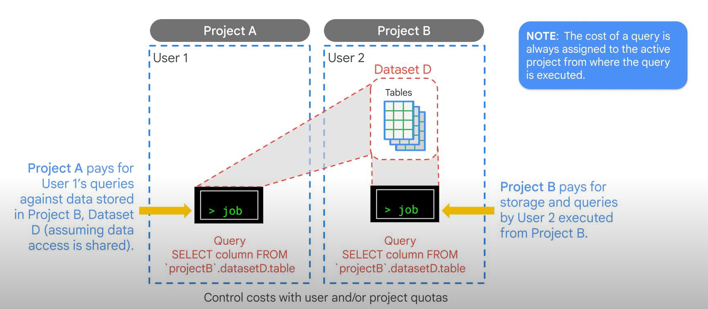

# Features

## Organization

- Projects -> Dataset -> Tables
- Use projects for billing and datasets/tables for access control
- Submit a QueryJob to the BigQuery service. The BigQuery query service is separate from the BigQuery storage service. However, they are designed to collaborate and be used together.
- Querying native tables is the most common case, and is the most performant way to use BigQuery. BigQuery is most efficient when working with data contained in its own storage service.

## Federated Query

- The query service can also run query jobs on data contained in other locations, such as tables in CSV files hosted in Cloud Storage.
- So you can query data in external tables or from external sources without loading it into BigQuery. These are called federated queries.

## Query Output

- the query service puts the results into a temporary table and the user interface pulls and displays the data in the temporary table.
- This temporary table is stored for 24 hours, so if you run the exact same query again, and if the results would not be different, then BigQuery will simply return a pointer to the cached results.
- Queries that can be served from the cache do not incur any charges. It is also possible to request that the query job write to a destination table.
- In that case, you get to control when the table is deleted. Because the destination table is permanent, and not temporary, you will get charged for the storage of the results.

## Pricing

- To calculate pricing, you can use BigQuery's query validator in combination with the pricing calculator for estimates.
- The query validator provides an estimate of the size of data that will be processed during a query.
- You can plug this into the calculator to find an estimate of how much running the query will cost.

## Smart Pricing

- By separating projects A and B, it’s possible to share data without giving access to run jobs.
- In this diagram, Users 1 and 2 have access to run jobs and access the datasets in their own respective Projects.
- If they run a query, that job is billed to their own project. What if User 1 needs the ability to access Dataset D in Project B?
- The person who owns Project B can allow User 1 to query Project B Dataset D and the charges will go to Project A when executed from Project A. The public dataset project owner granted all authenticated users access to use their data.
- The special setting allAuthenticatedUsers makes a dataset public. Authenticated users must use BigQuery within their own project and have access to run BigQuery jobs so that they can query the Public Dataset.
- The billing for the query goes to their project, even though the query is using public or shared data.
- In summary, the cost of a query is always assigned to the active project from where the query is executed. The active project for a user is displayed at the top of the Cloud Console or set by an environmental variable in the Cloud Shell or client tools. The project is what the billing is associated with.
- For example, if you queried a table that belongs to the 'bigquery-public-data' project, the storage costs are billed to that data project. To run a query, you need to be logged in to the Cloud Console. You will run a query in your own Google Cloud project and the query charges are billed to your project, not to the public data project.

## Permissions

- In order to run a query in a project, you need Identity Access Management (IAM) permission to submit a job.
- Remember that running a query means that you must be able to submit a query job to the service.
- Access control is through IAM and is at the dataset, table/view, or column level.
- In order to query data in a table or view, you need at least read permissions on the table or view.
- Authentication is through IAM, so it’s possible to use Gmail addresses or Google Workspace accounts for this task.
- Access control is through IAM roles and involves giving permissions.
- Remember that access control is at the level of datasets, tables, views, or columns. When you provide access to a dataset, either read or write, you provide access to all the tables in that dataset.

## Reliability and Security

- Like Cloud Storage, BigQuery datasets can be regional or multi-regional.
- Regional datasets are replicated across multiple zones in the region.
- As with Cloud Storage, BigQuery storage encrypts data at rest and over the wire using Google-managed encryption keys. It’s also possible to use customer-managed encryption keys.

## Low Level Access Control

- We can set access controls at the table or column level using views.
- We cannot export data from a view, and current dataset has to be in the same region or multi-region as source dataset.
- A view is a SQL query that looks like and has properties similar to a table.
- You can query a view just like you query a table. BigQuery supports materialized views as well.
- These are views that are persisted so that the table does not need to be queried every time the view is used.
- BigQuery will keep the materialized view refreshed and up to date with the contents of the source table.
- Giving view access to a dataset is also known as creating an authorized view in BigQuery. An authorized view allows you to share query results with particular users and groups without giving them access to the underlying source data.
- With column-level security you can achieve a similar use case, so that you can define when to show the content of the column, or when to hide or obfuscate it. You will define a Policy Tag in BigQuery and assign the corresponding users/groups to it. These users will now be able to see the column’s content.
- You can also define data masking rules and assign them to the Policy Tag and users/groups, so that the content is obfuscated / nullified / or transformed using your own custom logic.
- If a user/group isn’t included into the Policy Tag’s definition, they won’t be able to query the column at all.
- In BigQuery, row-level security involves the creation of row-level access policies on a target BigQuery table. This policy then acts as a filter to hide or display certain rows of data, depending on whether a user or group is in an allowed list.
- An authorized user, with the IAM roles BigQuery Admin or BigQuery DataOwner, can create row-level access policies on a BigQuery table.
- When you create a row-level access policy, you specify the table by name, and which users or groups (called the grantee-list) should have access to certain row data. The policy includes the data on which you wish to filter, called the filter_expression.
- The filter_expression functions like a WHERE clause in a typical query.
- In BigQuery, materialized views periodically cache the results of a query for increased performance and efficiency. BigQuery leverages precomputed results from materialized views and whenever possible reads only delta changes from the base table to compute up-to-date results.
- Materialized views can be queried directly or can be used by the BigQuery optimizer to process queries to the base tables. Queries that use materialized views are generally faster and consume fewer resources than queries that retrieve the same data only from the base table.
