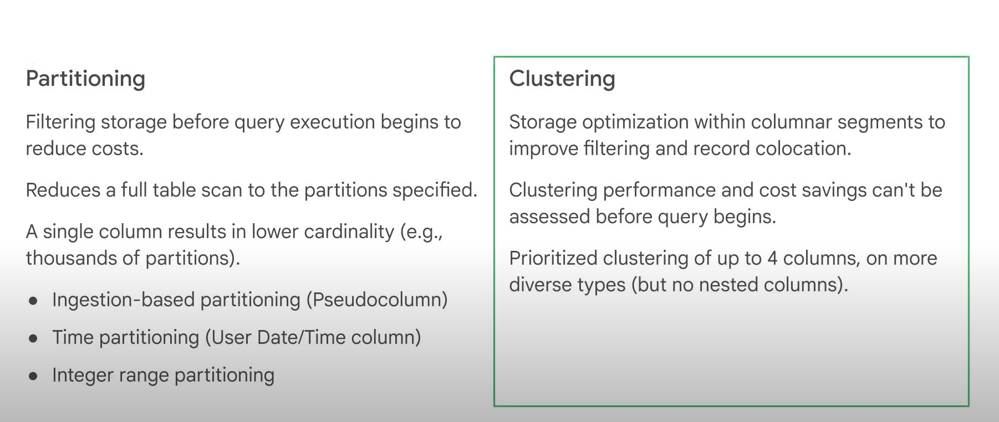

# Partition and Clustering

## Why do Partition Needed

- In a table partitions by a date or a timestamp column, each partition contains a single day of data.
- When the data is stored, BigQuery ensures that all the data in a block belongs to a single partition.
- A partition's table maintains these properties across all operations that modify it, query jobs, data manipulation language, DML statements, Data Definition Language, DDL statements, load jobs and copy jobs.
- This requires BigQuery to maintain more metadata than a non-partitioned table. As the number of partitions increases, the amount of metadata overhead increases.
- -Sometimes the query still processes 1.74 GB even though it returns 0 results. Why?
- The query engine needs to scan all records in the dataset to see if they satisfy the date matching condition in the WHERE clause. It must look at each record to compare the date against the condition given.
- One of the ways you can optimize the tables in your data warehouse is to reduce the cost and amount of data read by partitioning your tables.

## Partition

- allow us to completely ignore scanning records in certain partitions if they are irrelevant to our query.
- billing-enabled account will let you have partitioned tables that don't expire
- BigQuery creates new date based partitions automatically with no need for additional maintenance.
- In addition, you can specify an expiration time for data in the partitions.
- Partitioning can be set by ingestion time on a timestamp, date or date time column, or based on a range of an integer column.
- Although more metadata must be maintained, by ensuring that data is partitioned globally, BigQuery can more accurately estimate the bytes processed by a query before you run it.
- This cost calculation provides an upper bound on the final cost of the query.
- The good practice is to require that queries always include the partition filter, make sure that the partition field is isolated on the left side, because that's the only way BigQuery can quickly discard unnecessary partitions.
- For this, we need clustering the table with labels

## Auto-expiring partition

- Auto-expiring partitioned tables are used to comply with data privacy statutes, and can be used to avoid unnecessary storage (which you'll be charged for in a production environment).
- If you want to create a rolling window of data, add an expiration date so the partition disappears after you're finished using it

## Clustering

- Clustering can improve the performance of certain types of queries, such as queries that use Filter clauses, and those that aggregate data.
- When data is written to a clustered table by a query or a load job, BigQuery sorts the data using the values in the clustering columns. These values are used to organize the data into multiple blocks in BigQuery storage.
- When you submit a query containing a clause that filters data based on the clustering columns, BigQuery uses the sorted blocks to eliminate scans of unnecessary data.
- Similarly, when you submit a query that aggregates data based on the values and the clustering columns, performance is improved, because the sorted blocks co-locate rows with similar values.
- The columns you specify in the cluster are used to co-locate related data.
- When you cluster a table using multiple columns, the order of columns you specify is important. The order of the specified columns determines the sort order of the data.
- Over time, as more and more operations modify a table, the degree to which the data is sorted begins to weaken, and the table becomes only partially sorted.
- In a partially sorted table, queries that use the clustering columns may need to scan more blocks compared to a table that is fully sorted.
- You can re-cluster the data in the entire table by running a select asterisk query that selects from and overwrites the table.
- The great news is that BigQuery now periodically does auto re-clustering for you. Automatic re-clustering is absolutely free and automatically happens in the background.

## Summary

- BigQuery supports clustering for both partitioned and non-partitioned tables.
- When you use clustering and partitioning together, the data can be partitioned by a date, date time or timestamp column, and then clustered on a different set of columns.
- Partitioning provides a way to obtain accurate cost estimates for queries.
- Keep in mind, if you don't have partitioned columns, and you want the benefits of clustering, you can create a fake underscore date column of type date and have all the values be null.
