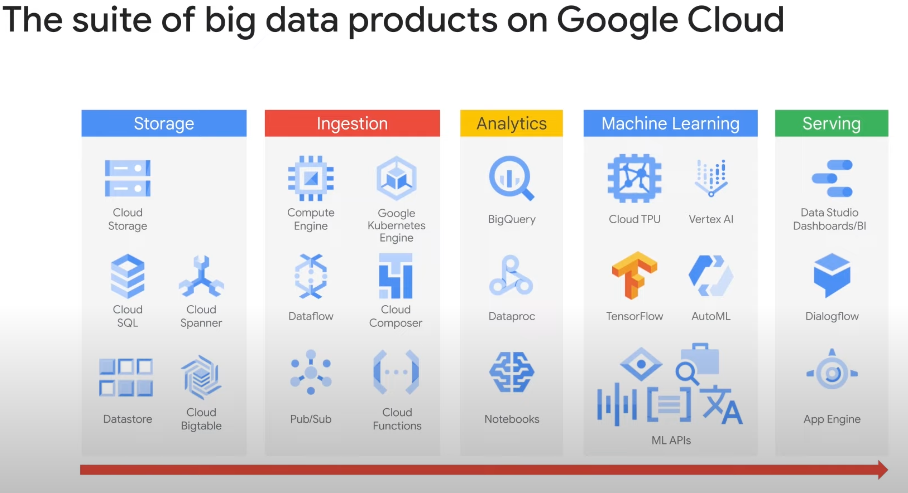

# Data Lake Overview

- Typically used to drive data analytics, data science and ML workloads, or batch and streaming data pipelines
- Accept all types of data
- Data lakes are portable, on-prem or in the cloud
- Provide a reliable way of retrieving and storing all the data (data sinks)
- First line of defense in enterprise data env
- "Give me whatever data at whatever volume, variaty of formats, and velocity you got, I can take it"

## Data Pipelines

- Actually performs the cleanup and processing of data
- responsible for doing transformation and processing the data at scale.

## General Steps of the Workflow

1. Raw Materials need to be brought to the job (DataLake)
2. Materials need to cut and transform for purpose and stored (pipelines to data sinks)
3. Actual outcome could be a new insight / ML Model
4. Supervisor who directs all aspects (workflow orchestration)

## GCP Services

## Difference between Data Lake and Data Warehouse

### Data Lake

- essentially the place where we capture every aspect of our business operations.
- tend to store the data in its natural raw format
- tend to store these things as object blobs or files
- advantage of data lake is that whenever the application gets upgraded it can start writing the new data immediately because it's just a capture of whatever raw data exists

### Data Warehouse

- load the data into a data warehouse only after you have a schema defined and the use case identified
- take the raw data that exists in a data lake, and transform it, organize it, process it, clean it up and then store it in a data warehouse
- tends to be structured and semi-structured data that is organized and placed in a format that makes it conducive for querying and analysis
