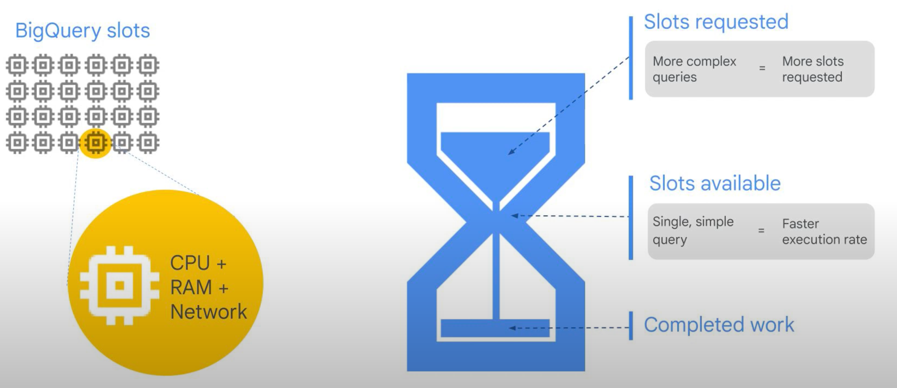
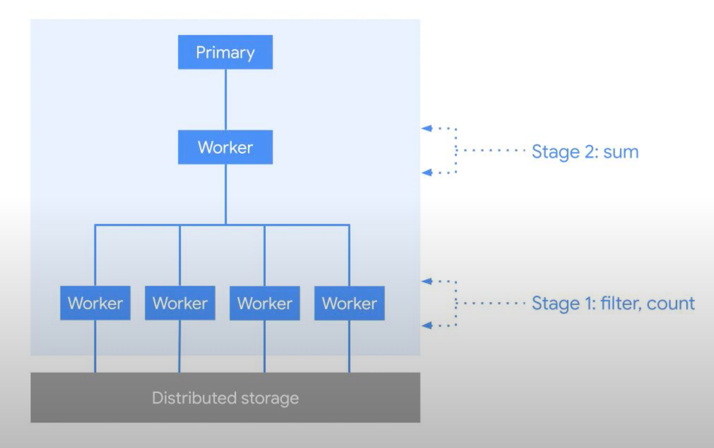

# BigQuery Overview

- Scale from gigabytes to petabytes of data.
- Serverless and fully no-ops.
- Seamlessly plug into whichever visualization or reporting tool our business is most familiar with.
- Able to integrate with an ecosystem of processing tools for building ETL pipelines.
- Capable of constantly refreshing data in the warehouse in order to keep it up to date. We need to be able to stream data into the warehouse and not rely on batch updates.
- Support machine learning without moving the data out of the warehouse.
- Frees up real people-hours by not working about low level tasks

## Architecture

- Two main parts: Storage Engine and Analytic Engine

- works effectively because of Google’s petabit network called Jupiter. Jupiter allows blazing fast communication between compute and storage.
- BigQuery data is physically stored on Google's distributed file system, called Colossus, which ensures durability by using erasure encoding to store redundant chunks of the data on multiple physical disks.
- Data is replicated to multiple data centers. You don't need to provision resources before using BigQuery, unlike many RDBMS systems.
- BigQuery allocates storage and query resources dynamically based on your usage patterns. Storage resources are allocated as you consume them and deallocated as you remove data or drop tables.
- Query resources are allocated according to query type and complexity. Each query uses some number of slots, which are units of computation that comprise a certain amount of CPU and RAM.

## Why is it so fast

- BigQuery tables are column-oriented, compared to traditional RDBMS tables which are row-oriented. Row-oriented tables are efficient for making updates to data contained in fields.
- For OLTP systems, row-oriented tables are necessary because OLTP systems have frequent updates. Analytics is slow on row-oriented tables because queries have to read all the fields in a row and, depending on the kind of indexing or key, queries may have to read extra rows and fields to find the information that is requested.
- BigQuery, however, is an O-LAP system. It’s meant for analytics. BigQuery tables are immutable and are optimized for reading and appending data. BigQuery tables are not optimized for updating.
- BigQuery leverages the fact that most queries involve few columns, so it only reads the columns required for the query.
- BigQuery is very efficient in this sense and is the reason tables are column-oriented.
- Every table has a schema. You can enter the schema manually through the Cloud Console, or by supplying a JSON file.

## Underlying Arch

- BigQuery is implemented using a microservice architecture, so there are no virtual machines to configure and maintain.
- Under the hood, analytics throughput is measured in BigQuery slots.
- A BigQuery slot is a unit of computational capacity required to execute SQL queries.
- BigQuery automatically calculates how many slots are required at each stage in a query, depending on size and complexity.
- A BigQuery slot is a combination of CPU, memory, and networking resources.
- It also includes a number of supporting technologies and sub-services.
- Note that each slot doesn’t necessarily have the same specification during query execution.
- Some slots may have more memory than others, or more CPU or more I/O.

## Sample Workflow

- Multiple slots work together under the hood to execute a query.
- Imagine a slot operates here the same way as a worker node in a cluster for distributed processing of big data.
- When executing a query, BigQuery may split it up into one or multiple stages that contain different tasks to do.
- Tasks are assigned to workers to perform the work in parallel.
- In this example, we have 2 stages.
- In the first one, the workers will pick up a subset of the data they need to work on from BigQuery’s storage, then they apply a specific filter to their data (coming from the WHERE clause) and do a partial count of the data that is left (which is specified as COUNT() in the SELECT clause).
- Each worker will send its intermediate result to stage 2, where one worker will create the final result set by summing up all the counts it received by the previous workers.
- This result set is then presented to us in the UI.
