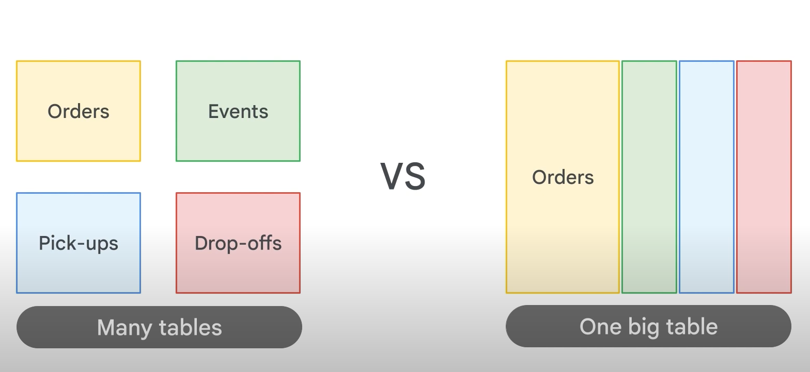
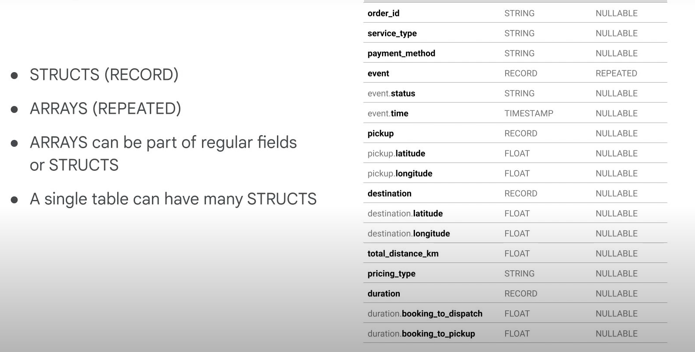
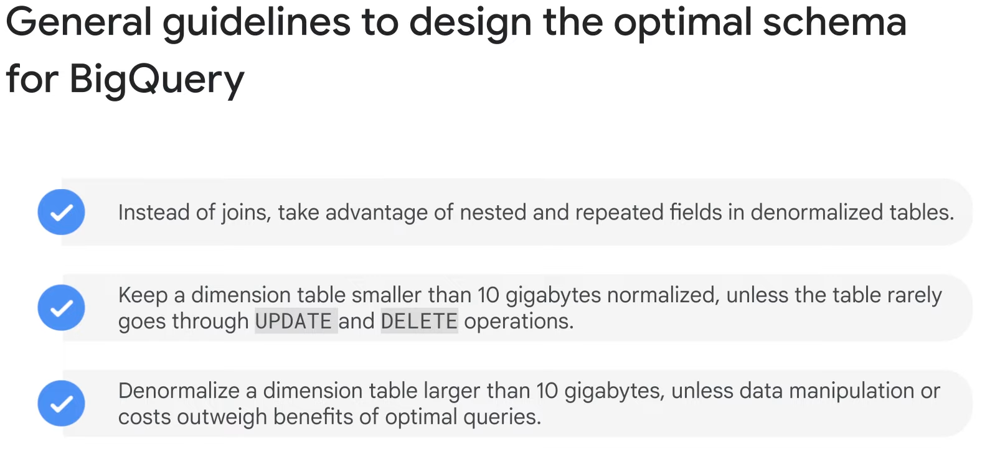

# Why used nested and repeated fields

## Order App UseCase

- we could store one fact in one place with the normalization route, which is typical for relational systems.
- Or we could go the fully denormalized route and just store all levels of granularity in a single big table,
- where you would have one order ID like 123 repeated in a row for each event that happens on that order.
- Faster for querying, sure, but what are the drawbacks?
- For relational schemas, normalized schemas, often the most intensive computational workloads are joins across very large tables.
- Remember, RDBMSs are record based, so they have to open each record entirely, and pull out the join key from each table where a match exists.
- And that's assuming you know all the tables that need to be joined together.
- Imagine for each new piece of information about an order like promotion codes, or user information, and you could be talking about 10 plus table join.
- The alternative has different drawbacks.
- Pre-joining all your tables into one massive table makes reading data faster, but you now have to be really careful if you have data at different levels of granularity.
- In our example, each row would be at the level of granularity of a specific event like driver confirmed for a given order.
- What does that mean for an order ID like 123?
- It is duplicated for each event in that order.
- Imagine if you're looking to join higher level information like the revenue per order, and you now have to be exceedingly careful with aggregations to not double or triple count your duplicate order IDs.

## Solution

- One common solution in enterprise data warehouse schemas is to take advantage of nested and repeated data fields.
- You can have one row for each order, and repeated values within that one row for data that is at a more granular level.
- For example, you could simply have an array of timestamps as your events.

## Overview of New Data Structures

## STRUCTS

- Structs are standard SQL data types and BigQuery just supports them really well.
- Structs you can think of as pre-joined tables within a table.
- So instead of having a separate table for event and pickup and destination, you simply nest them within your main table.
- Structs are a type of record when looking at a schema, and arrays are of mode repeated.
- CROSS JOIN to break STRUCT into rows

## ARRAYS

- Arrays can be of any single type, like an array of floats, or an array of strings, et cetera.
- Arrays can be part of a regular field or be part of a nested field nestled inside of a struct, a single table can have zero to many structs.
- Use UNNEST to make arrays into individual rows
- An array is simply a list of items in brackets [ ]
- BigQuery visually displays arrays as flattened. It simply lists the value in the array vertically (note that all of those values still belong to a single row)

## General Guidelines for Schema

